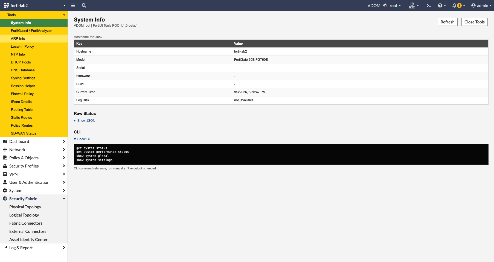
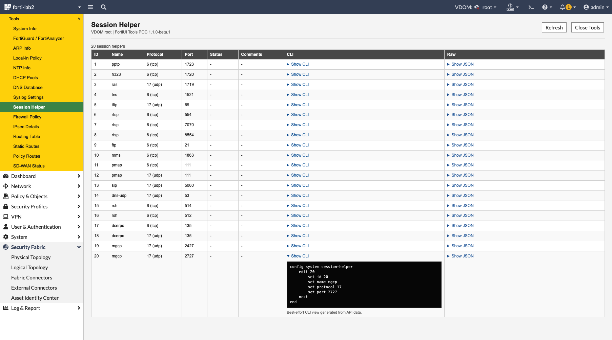
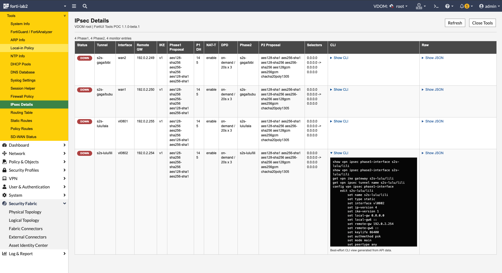

# FortiUI Unhider

FortiUI Unhider is a browser bookmarklet that adds an integrated `Unhider` menu to the FortiGate WebUI and renders useful configuration and runtime data that is otherwise hidden, scattered across many pages, or only practical to inspect from the CLI.

It runs inside your already authenticated FortiGate WebUI session and uses FortiGate's own same-origin API endpoints. No credentials are stored in the bookmarklet.



## Why This Exists

FortiGate contains a lot of operationally important configuration that is hard to inspect quickly in the GUI:

- Some settings are CLI-only or nearly hidden in advanced dialogs.
- Some information is split across monitor APIs, CMDB APIs, and different GUI sections.
- Reviews often require comparing config, runtime status, filters, routes, and generated CLI commands side by side.
- The normal GUI is optimized for editing one object at a time, not for fast read-only auditing.

FortiUI Unhider adds read-only overview pages directly into the WebUI navigation so you can inspect these details without leaving the browser.

## Features

Current `1.1.0` release pages:

- `System Info`
- `FortiGuard / FortiAnalyzer`
- `ARP Info`
- `Local-in Policy`
- `NTP Info`
- `DHCP Pools`
- `DNS Database`
- `Syslog Settings`
- `Session Helper`
- `Firewall Policy` (all options, non-default highlighting, live search, interface pair view)
- `IPsec Details`
- `Routing Table`
- `Static Routes`
- `Policy Routes`
- `SD-WAN Status`

Most tables include:

- normalized overview columns
- expandable raw JSON
- expandable CLI-style output
- best-effort `config ... edit ... set ...` snippets for configurable objects
- `show`, `get`, and `diagnose` command references for runtime/monitor data



## Firewall Policy Audit

The FortiGate GUI only exposes a subset of the firewall policy options. The `Firewall Policy` page (and the native policy edit page) show every option of a policy, comparable to `get` inside `config firewall policy` / `edit <id>` on the CLI, and make CLI-only changes visible at a glance.

### All Options

- Each policy on the `Firewall Policy` page has an expandable `All Options` column with every option, its value, the FortiOS default, and whether the option is visible in the GUI or `CLI only`.
- While the bookmarklet is active, opening a policy in the native WebUI (`/ng/firewall/policy/policy/.../edit/<id>`) injects an `Unhider: all options of policy <id>` panel below the edit form. If the form cannot be located, the panel is docked at the bottom right.
- Each options view has its own filter, an `Only non-default` toggle, option help texts on hover, and a `get` / `show` style CLI block.
- Values come from the saved configuration; unsaved changes in the edit dialog are not reflected.

### Non-Default Highlighting

Defaults and help texts are read via `?action=default` / `?action=schema`.

- **Red:** an option that is *not visible in the FortiGate GUI* (CLI only) differs from its default, for example `anti-replay disable`, `session-ttl 3600` or `auto-asic-offload disable`. These values are listed in red directly in the policy row, and the row gets a red marker.
- **Yellow:** a GUI-visible option differs from its default, for example `nat enable` or a security profile.
- **Find non-default values:** the red toggle in the toolbar shows only policies with at least one red value.

Which options count as GUI-visible is a curated list (`policyGuiFields` in `src/fortiui-unhider.js`, based on the FortiOS 7.2 policy dialog). Everything else is treated as CLI only. If default values are not available on a FortiOS build, highlighting and the toggle are disabled.

### Live Search

- Filters while typing across *all* policy option values, not only the visible columns, and highlights the matches.
- Multiple terms are combined with AND, `"..."` searches a phrase, and `key=value` matches a specific option, for example `nat=enable`, `logtraffic=disable`, `ssl-ssh-profile=deep`.
- Matches in options that are not shown as columns are listed in the `All Options` cell; opening it pre-fills its filter with the search.
- `Esc` clears the search.

### Interface Pair View

- Switch between `List` and `Interface Pair View`.
- Policies are grouped by source → destination interface in policy order, with collapsible groups, `Expand all` / `Collapse all`, per-group counts, and a red count for policies with non-default CLI-only values.
- `Source` / `Destination` dropdowns filter by interface in both views.

Search, view, filters and collapsed groups are kept on `Refresh`.

## Usage

1. Open `dist/fortiui-unhider.bookmarklet.txt`.
2. Create a new browser bookmark.
3. Set the bookmark URL to the complete one-line content of `dist/fortiui-unhider.bookmarklet.txt`.
4. Log in to your FortiGate WebUI.
5. Open any normal FortiGate page, for example `/ng/vpn/ipsec?vdom=root`.
6. Click the bookmark.
7. A new `Unhider` menu appears in the left navigation.

Click `Close Tools` or navigate to a normal FortiGate menu item to return to the original WebUI view.

## Bookmarklet Notes

The bookmarklet is intentionally distributed as a plain text file because browsers expect bookmark URLs to start with `javascript:`.

Use this file for the bookmark:

```text
dist/fortiui-unhider.bookmarklet.txt
```

Use this file for development or browser DevTools snippets:

```text
src/fortiui-unhider.js
```

## Security Model

FortiUI Unhider is designed to be read-only.

- It uses `GET` requests only.
- It does not store credentials.
- It relies on the active FortiGate WebUI session in your browser.
- It masks obvious secret fields such as passwords, PSKs, shared secrets, and DDNS keys in JSON and generated CLI output.
- It does not send data to external services.

As with any bookmarklet, review the code before using it on production systems.

## Example: IPsec Details

The IPsec page combines phase1 config, phase2 config, and monitor status in one table.



It can show data such as:

- tunnel status
- tunnel name
- interface
- remote gateway
- IKE version
- phase1 proposals
- phase2 proposals
- selectors
- CLI commands and generated config snippets

## Development

Regenerate the bookmarklet after editing `src/fortiui-unhider.js`:

```sh
node scripts/make-bookmarklet.js src/fortiui-unhider.js dist/fortiui-unhider.bookmarklet.txt
```

Validate syntax:

```sh
npm test
```

## Project Structure

```text
.
├── demopics/
├── dist/
│   └── fortiui-unhider.bookmarklet.txt
├── scripts/
│   └── make-bookmarklet.js
├── src/
│   └── fortiui-unhider.js
├── package.json
└── README.md
```

## Compatibility

The current version was developed and tested against FortiOS `7.2.8` on a FortiGate 60E lab firewall.

FortiGate WebUI internals and API schemas may differ between FortiOS versions. If a page fails, open the browser console and check which API endpoint returned an error.

## Changelog

### 1.1.0

- Firewall Policy: `All Options` view with defaults, GUI / CLI-only classification and `get` / `show` CLI output.
- Firewall Policy: red highlighting of non-default CLI-only options and a global `Find non-default values` filter.
- Firewall Policy: live full-text search with match highlighting and `key=value` syntax.
- Firewall Policy: interface pair view with collapsible groups and source / destination interface filters.
- Native policy edit page: injected panel with all options of the opened policy.
- Re-running the bookmarklet cleans up the previous instance.

### 1.0.0

- Initial release.

## Credits

This project was inspired by FortiGate WebUI bookmarklet techniques that inject custom read-only tooling into the FortiGate navigation and render API/CLI-derived data directly in the WebUI.
